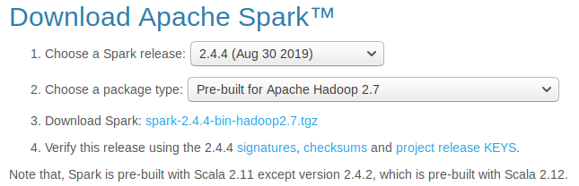
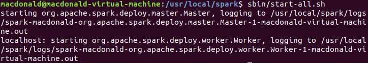

# 实验三报告

**基本需求**：利用用户购物数据集，分析预测回头客。涉及数据预处理、存储、查询、排序、统计分析等数据处理全流程所涉及的各种典型应用场景，涵盖 Hadoop、MapReduce、Spark、Hive、HBase 等系统和软件的安装和使用方法。培养 MapReduce 和 Spark 的编程能力，并尝试应用机器学习算法进行大数据挖掘。实验将分阶段完成。


### 阶段一 MapReduce 编程

> - 精简数据集：淘宝双十一用户购物数据集（100万条），见附件 million_user_log.csv.zip
>
> - 基于精简数据集完成 MapReduce 作业：
>   - 统计各省的双十一前十热门关注产品（“点击+添加购物车+购买+关注”总量最多前10的产品）
>   - 统计各省的双十一前十热门销售产品（购买最多前10的产品）


##### 我的思路

​	分析这两个问题，可以看出两者的需求其实非常相似，均包括“各省”、“前十”两个核心部分，区别仅在于考察产品受到的不同行为 Action，前者的对象是 Action 为任意值，后者则是限定购买行为即 Action == 2，所以题目跨度并不大，可以说如果做出第一题，只需要做不多的工作就能完成阶段一。

​	考虑到数据集中一行数据，正好就是一次“点击”、“添加购物车”、“购买”抑或是“关注”，而第一道题又是统计所有的行为，所以可以这本质也是一个 WorldCount 问题，只不过要分省份来“统计单词”罢了。而统计完后，按各省内的排序结果输出前十名就可以完成了。

##### 代码展示与说明

​	Map 函数中对每一行的内容按 "," 分割，并根据要求做出限定，例如给出的这段代码中就要求第八个字段，即 Action 等于 2，在这个过程中筛选出了购物行为的数据，并以 (省份，商品 id) 形式的输出键值对到后面的环节。

```java
@Override
protected void map(LongWritable key, Text value, Context context) throws IOException, InterruptedException {
    System.out.println("map");

    String[] lines = value.toString().split(",");

    if (lines.length < 1 || !lines[7].equals("2"))
        return;

    mkey.set(lines[10]);
    mvalue.set(lines[1]);
    context.write(mkey, mvalue);
}
```

​	Reduce 函数中做的是在每一个省份下统计每一件商品的个数，得到一串序列，统计完成后进行排序，并输出前十名，即得到结果。

```java
@Override
protected void reduce(Text mkey, Iterable<Text> iter, Context context) throws IOException, InterruptedException {
    System.out.println("reduce");
    List<MyCom> glist = new ArrayList<>();

    for (Text it : iter){
        String name = it.toString();

        boolean flag = false;
        for (MyCom myCom : glist) {
            if (name.equals(myCom.getName())) {
                flag = true;
                myCom.addOne();
                break;
            }
        }
        if (!flag){
            MyCom tmp = new MyCom(name);
            glist.add(tmp);
        }
    }

    Collections.sort(glist);
    Collections.reverse(glist);

    for (int k = 0; k < 10; k ++){
        MyCom g = glist.get(k);
        rvalue.set("No." + (k + 1) + " Good: "+ g.getName() + " Bought by " + g.getNum());
        context.write(mkey, rvalue);
    }

    context.write(new Text(""), new Text(""));
}
```

##### 结果展示

- 各省前十的热门关注产品


- 各省前十的热销产品


##### 代码路径

- FBDP_exp3/Step 1/Toptenbuy.java
- FBDP_exp3/Step 1/Toptenfollow.java

##### 结果路径：

- FBDP_exp3/Step 1/Toptenbuy.txt
- FBDP_exp3/Step 1/Toptenbuy.txt


### 阶段二 Hive 操作

> - Hive操作
> 	- 把精简数据集导入到数据仓库Hive中，并对数据仓库Hive中的数据进行查询分析
> 	- 查询双11那天有多少人购买了商品
> 	- 查询双11那天男女买家购买商品的比例
>	- 查询双11那天浏览次数前十的品牌

这是一个几乎不依赖代码的阶段，但麻烦程度却是最高的之一。

在这个阶段中有很多配置环境的尝试，踩过许许多多坑，部分有截图记录，部分没有，甚至如果让做完了的我重新再弄一次，我可能也搞不清楚哪些坑是因为哪些原因产生的。

##### 配置环境

我的尝试中，首先是 Hive 1.2.1，后面因为各种问题，不得不替换为了 2.3.3 的版本。在这里列出一些让我最终成功的配置。

首先是环境变量 `bashrc`


然后是 `hive-site.png` 文件的内容


接着成功安装 mysql 并启动服务


这之后还有许多小 bug 就不再记录了，因为实在是过于繁多而细微，遇到一个就只能到网上参考各种方法，配合快照进行尝试解决，仔细研究的意义实在是不太大。

直接来到成功启动 hive 的环节。


并成功地初始化。


接着把数据集上传到 hdfs 上。


然后也可以从浏览器中看到成功上传的内容。


然后使用 hive 创建需要的表，设置如下。

```sql
CREATE TABLE if not exists DE (
userid INT, 
itemid INT,
catid INT, 
merchantid INT,
brandid INT,
month INT,
day INT,
action INT,
agerange INT,
gender INT,
province STRING) 
ROW FORMAT DELIMITED FIELDS TERMINATED BY ',' STORED AS TEXTFILE;
```


然后从 hdfs 上加载数据到创建好的表中。


进行简单的 select 操作测试，可以看到数据导入成功，终于可以进行作业了。


##### 问题解答

【一、查询双11那天有多少人购买了商品】

查询代码如下

```sql
select count(*) from DE where action=2;
```

运行结果如图


【二、查询双11那天男女买家购买商品的比例】

查询代码如下

```sql
select count(*) from DE where action=2 and gender=0;
select count(*) from DE where action=2 and gender=1;
```

查询结果如图


【三、查询双11那天浏览次数前十的品牌】

查询代码如下

```sql
SELECT brandid, count(*)as times FROM DE where action=0 group by brandid order by times desc limit 10;
```

查询结果如图


### 阶段三 Spark 编程

> - 基于精简数据集完成Spark作业：
>   - 统计各省销售最好的产品类别前十（销售最多前10的产品类别）
>   - 统计各省的双十一前十热门销售产品（购买最多前10的产品）-- 和MapReduce作业对比结果
>   - 查询双11那天浏览次数前十的品牌 -- 和Hive作业对比结果

这个阶段则是【戏剧性满满】。

##### 曲折的尝试


首先是进入实验二时装好 java 和 ssh 的环境中，心中已经暗自决定使用 python，但是却有些不确定，因为还没有在 linux 上用过 python。

先进行下载



然后解压

```shell
sudo tar -zxvf spark-2.4.4-bin-hadoop2.7.tgz spark-2.4.4-bin-hadoop2.7/ -C /usr/local
```

不知道为什么还是解压到了原处

```shell
sudo mv spark-2.4.4-bin-hadoop2.7 /usr/local
cd /usr/local
sudo mv spark-2.4.4-bin-hadoop2.7 spark
```

配置环境

```shell
vi /etc/profile
#SPARK_HOME
export SPARK_HOME=/home/hadoop/spark-2.2.0-bin-hadoop2.6
export PATH=$SPARK_HOME/bin:$PATH
cd spark/
cd conf/
ls
```


对 template 文件复制一份并重命名为 spark-env.sh


查看 java 路径`echo $JAVA_HOME`


修改 spark-env.sh 文件，在尾部添加

```shell
export JAVA_HOME=/usr/java/jdk1.8.0_221
export SPARK_MASTER_HOST=macdonald-virtual-machine
export SPARK_MASTER_PORT=7077
```


回到 spark 的主目录中，找到 sbin 目录，然后启动 spark，使用命令`sbin/start-all.sh`



使用 `jps` 查看是否启动成功


显示了正确的内容，接下来试着使用它自带的 example 中求圆周率的示例程序，参数设置为 100

```shell
bin/spark-submit --master spark://macdonald-virtual-machine:7077 --class org.apache.spark.examples.SparkPi examples/jars/spark-examples_2.11-2.4.4.jar 100
```
经历了半分钟的等待（比网上慢了20+s，可能是机器性能差异的问题），终于得到结果


成功。另外创建两个文件夹分别用作输入输出

```shell
sudo mkdir -p /data/input
sudo mkdir -p /data/output
```

在 input 中创建一个 data.txt 并进行输入以下内容


启动 spark-shell
```shell
bin/spark-shell --master spark://macdonald-virtual-machine:7077
```


试运行 WordCount 代码

```java
sc.textFile("/data/input/data.txt").flatMap(_.split(" ")).map((_,1)).reduceByKey(_+_).collect
```

得到正确的单词统计结果


接下来便进入到新的环节，因为在我开始做之前，就有已经做好的大佬说 python 做起来比较便捷，于是开始安装 python。

```shell
sudo apt install python
```


开启pyspark


可以正常运行简单的程序。但为了方便，还是安装 jupyter notebook

```shell
sudo apt install jupyter
```


为了配置 PySpark in Jupyter，便要设置相应的环境变量，去 `~/.bashrc` 文件最后，添加配置 PySpark driver 的环境变量。

``` shell
sudo vi ~/.bashrc
source ~/.bashrc
```

其中插入的是以下内容


然后就惊喜地 pyspark 可以直接打开notebook 了！


然后伤心的记忆就是从这开始的。
起初简单地试运行 spark 的相关功能模块发现报错，便想着要不就学网上大多数人用的 findspark 来关联 python 和 spark 吧。

```shell
sudo apt install python-pip
pip install findspark
```


却有这样的问题：


于是觉悟是版本的问题，因为虚拟机上既有 python 2 也有 python 3！在最开始的时候，尝试过不安装 python 2 就无法启动 pyspark，或许必须得使用 python 2 的内核。然而在安装 jupyter 的时候提示没有 pip，所以当时灵机一动直接使用了 `sudo apt install jupyter`，这时候突然意识到这装的就是 python 3 的 jupyter 内核，而不是 pip 对应的 python 2。

在这里要改用 pip 来安装的话还要卸载之前的版本，就很麻烦，所以打算使用快照，回跳。

于是几乎重做一遍前面的环节，但区别是把 `sudo apt install python-pip` 放在 juypter 的安装前面，用 `pip install jupyter` 来安装jupyter，然后没想到是，这次直接就在这里遇到了报错。


做到这里，受限于机器配置，以及虚拟机操作起来总是让人难以保持耐心，也因为先前就听说 Windows 上完成实验也比较容易，于是果断地转换了策略。

至此，先前花费在虚拟机上的两三个小时变成了徒劳。

##### 正确的道路

回到熟悉、亲切、自然的 Windows 上，基于先前的经历等，我熟练地展开了以下操作：

1.	下载解压spark
2.	配置环境变量
3.	python -m pip install findspark
4.	补充配置 spark 驱动的环境变量
5.	启动 jupyter notebook 跑样例

只用了花在 Linux 上的<u>大概十分之一的时间</u>，就成功配置好了基本的环境，让人唏嘘不已。


##### 代码介绍

首先是相关包的导入和基本设置。

```python
import findspark
findspark.init()

import pyspark
from pyspark.sql import SparkSession
from pyspark import SparkContext
from pyspark import SparkConf
conf=SparkConf().setAppName("miniProject").setMaster("local[*]")
sc=SparkContext.getOrCreate(conf)
```

然后是第一小问的解答。就像注释里写的那样，我先后将数据集：

- 通过 filter 操作筛选出购买行为
- 通过 map, reduceByKey 完成按省归类统计次数（对应阶段一中的 MapRuduce 环节）
- 通过 map, groupByKey 转换为方便后续进行排序的数据结构
- 通过 map 配合 sorted 函数以及切片取出了各省中的销售量前十产品

```python
# 统计各省销售最好的产品类别前十（销售最多前10的产品类别）

# 购买行为
buy_action = lines.filter(lambda x: x.split(',')[7]=="2")
# 转换为（‘省份，类别’，次数）
groupby_provincebrand = buy_action.map(lambda x: (x.split(',')[10]+','+x.split(',')[2], 1)).reduceByKey(lambda a, b : a + b)
# 转换为（省份，（类别，次数））
groupby_province = groupby_provincebrand.map(lambda x: (x[0].split(',')[0],(x[0].split(',')[1],x[1])))
# 将 item 按省份集合起来
each_province = groupby_province.groupByKey()
# 在个省份内按销量排序，取出最高十条
result = each_province.map(lambda x: (x[0], sorted(list(x[1]), key=lambda y: y[1], reverse=True)[:10]))

result.collect()
```

输出结果节选截图如下。


**第二小问** 只需在第一小问的基础上稍作修改，通过更改下标将考察的对象从品牌种类改成商品的 id，即可得到结果。代码如下。

```python
# 统计各省的双十一前十热门销售产品（购买最多前10的产品）

# 购买行为
buy_action = lines.filter(lambda x: x.split(',')[7]=="2")
# 转换为（‘省份，类别’，次数）
groupby_provincebrand = buy_action.map(lambda x: (x.split(',')[10]+','+x.split(',')[1], 1)).reduceByKey(lambda a, b : a + b)
# 转换为（省份，（类别，次数））
groupby_province = groupby_provincebrand.map(lambda x: (x[0].split(',')[0],(x[0].split(',')[1],x[1])))
# 将 item 按省份集合起来
each_province = groupby_province.groupByKey()
# 在个省份内按销量排序，取出最高十条
result = each_province.map(lambda x: (x[0], sorted(list(x[1]), key=lambda y: y[1], reverse=True)[:10]))

result.collect()
```

输出结果节选如下（下一），可以看到和阶段一中 MapReduce 编程运行得到的结果（下二）一致。


**第三小问 **决定使用 spark.sql 来完成，一方面是因为新鲜感，另一方面当然也是因为这样比较简便。

```python
# 读取数据为 dataframe 格式
df = spark.read.csv('res/million_user_log.csv', encoding='utf-8', header=True, inferSchema=True)
df.show()

# 创建视图，并执行简单的 sql 指令
df.createOrReplaceTempView("millions")
spark.sql('''select * from millions''').show()

# 查询双11那天浏览次数前十的品牌
spark.sql('''SELECT first(brand), count(*)as times FROM millions where action=0 group by brand order by times desc limit 10''').show()
```

输出结果如下，可以看到和阶段二中 Hive 操作得到的结果一致。

```python
+-------------------+-----+
|first(brand, false)|times|
+-------------------+-----+
|               1360|49151|
|               3738|10130|
|                 82| 9719|
|               1446| 9426|
|               6215| 8568|
|               1214| 8470|
|               5376| 8282|
|               2276| 7990|
|               1662| 7808|
|               8235| 7661|
+-------------------+-----+
```


### 阶段四 数据挖掘

> - 针对预处理后的训练集和测试集，基于MapReduce或Spark MLlib编写程序预测回头客
> - 评估预测准确率（可选）

与前面每个阶段都不同，阶段四非常让人舒服，因为一上来就可以直接学习算法写代码，而不是配置环境面对各种稀有报错。于是直接进入正式环节。

##### 代码展示

首先是引入各种包、模块，并进行相应的初始化。

```python
import findspark
findspark.init()

import pyspark
from pyspark import SparkContext
from pyspark import SparkConf
from pyspark import mllib
from pyspark.mllib.regression import LabeledPoint
from pyspark.mllib.tree import DecisionTree
from pyspark.mllib.classification import SVMWithSGD, LogisticRegressionWithSGD, NaiveBayes
import pyspark.mllib.evaluation as ev

conf = SparkConf().setAppName("miniProject").setMaster("local[*]")
sc = SparkContext.getOrCreate(conf)
```

读入预处理后的数据，生成 RDD

```python
data = sc.textFile("train_after.csv")
```

将 RDD 构建为 Mllib 中的模型能够使用的数据格式 LabeledPoint

```python
labeled_data = data.map(lambda x: LabeledPoint(x.split(",")[-1], x.split(",")[:-1]))
```

按照 3:1 的比例划分训练集与测试集

```python
train, test = labeled_data.randomSplit([0.75, 0.25])
```

定义评估函数放在前面，方便后面多种机器学习算法的调用

```python
def eva(result):
    metrics = ev.BinaryClassificationMetrics(result)
    N = result.count()
    accuracy = 1.0 * result.filter(lambda p: p[0] == p[1]).count() / N
    print("【Area Under ROC】{0:.2f}".format(metrics.areaUnderROC))
    print("【Area Under PR】{0:.2f}".format(metrics.areaUnderPR))
    print("【Accuracy】{0:.2f}".format(accuracy))
```

##### 1 决策树

```python
# 构造决策树模型并进行训练
model_1 = DecisionTree.trainRegressor(train, {})

# 得到预测结果
y_pred_1 = model_1.predict(test.map(lambda row: row.features))
print(y_pred_1.take(10))

# 将概率转换为对应的 0 或 1
y_pred_1 = y_pred_1.map(lambda x: float(trans(x)))

# 提取真实值
y_ture = test.map(lambda row: row.label)

# 将真实值与预测值进行配对
result_1 = y_pred_1.zip(y_ture)
print(result_1.take(10))
```

预测概率、预测结果和真实情况比对如下（各取前十条）

```
[0.04611837048424289, 0.08620689655172414, 0.06111111111111111, 0.08288770053475936, 0.032148900169204735, 0.08620689655172414, 0.04611837048424289, 0.04611837048424289, 0.04611837048424289, 0.032148900169204735]
[(0.0, 0.0), (0.0, 0.0), (0.0, 0.0), (0.0, 0.0), (0.0, 1.0), (0.0, 0.0), (0.0, 0.0), (0.0, 0.0), (0.0, 0.0), (0.0, 0.0)]
```

对结果进行评估并输出。

```python
# 使用先前定义过的函数 eva
eva(result_1)
```

输出的结果如下

```python
【Area Under ROC】0.50
【Area Under PR】0.03
【Accuracy】0.94
```

##### 2 支持向量机SVM

由于模型预测、结果评估等代码内容在各个算法部分相同，所以接下来都只展示不同的部分以及结果。

```python
# 构造 SVM 模型并进行训练，其中设置迭代次数为 1000
numIterations = 1000
model_2 = SVMWithSGD.train(train, numIterations)
```

预测与真实值对比前十条
```
[(0.0, 0.0), (0.0, 0.0), (0.0, 0.0), (0.0, 0.0), (0.0, 1.0), (0.0, 0.0), (0.0, 0.0), (0.0, 0.0), (0.0, 0.0), (0.0, 0.0)]
```

对结果进行评估并输出。

```python
# 使用先前定义过的函数 eva
eva(result_2)
```
输出的结果如下

```python
【Area Under ROC】0.50
【Area Under PR】0.06
【Accuracy】0.94
```

##### 3 LogisticRegression

在尝试这个算法的过程中发现一个有趣的现象：这里的 numIterations 不能设置太大，例如 100、1000 等，否则会导致预测的结果全部为 1，即完全相反，最终的准确率也只有 4% 而已。

而如果设置小一些，例如最后我采取的 10，就不会出现这样的问题，最后得到的 Accuracy 还是很高（其实应该是全预测 0，因为和 SVM 的结果完全一样，这应该是数据集的锅）

```python
# 构造 LogisticRegression 模型并进行训练，其中设置迭代次数为 10
numIterations = 10
model_3 = LogisticRegressionWithSGD.train(train, numIterations)
```

预测与真实值对比前十条
```
[(0.0, 0.0), (0.0, 0.0), (0.0, 0.0), (0.0, 0.0), (0.0, 1.0), (0.0, 0.0), (0.0, 0.0), (0.0, 0.0), (0.0, 0.0), (0.0, 0.0)]
```

对结果进行评估并输出。

```python
# 使用先前定义过的函数 eva
eva(result_3)
```
输出的结果如下

```python
【Area Under ROC】0.50
【Area Under PR】0.06
【Accuracy】0.94
```

##### 4 朴素贝叶斯

```python
# 构造贝叶斯模型并进行训练
model_4 = NaiveBayes.train(train, 1.0)
```

预测与真实值对比前十条
```
[(0.0, 0.0), (1.0, 0.0), (1.0, 0.0), (0.0, 0.0), (1.0, 1.0), (1.0, 0.0), (0.0, 0.0), (1.0, 0.0), (0.0, 0.0), (1.0, 0.0)]
```

对结果进行评估并输出。

```python
# 使用先前定义过的函数 eva
eva(result_4)
```

输出的结果如下

```python
【Area Under ROC】0.51
【Area Under PR】0.07
【Accuracy】0.55
```

终于得到了不太一样的结果，还是挺开心的。